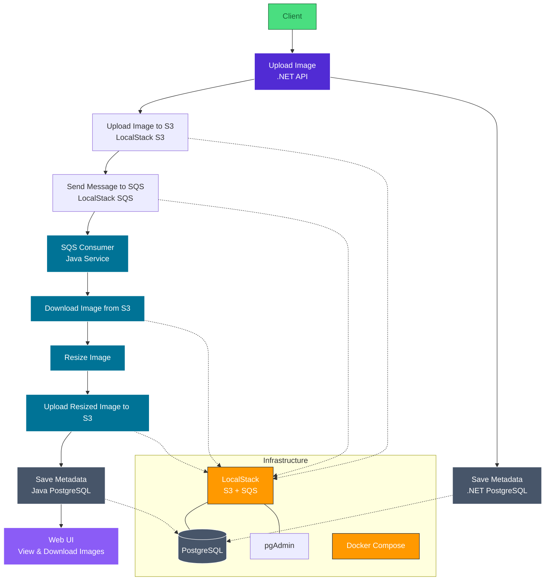

# Cloud-Native Polyglot Processor (2026)

A local-first AWS environment demonstrating a distributed image processing system using .NET, Java, and LocalStack.

## Architecture Overview

The system follows a decoupled microservice pattern:

1. Infrastructure: LocalStack (Docker) provides S3, SQS, and DynamoDB locally.
2. Web API (.NET 10): Handles file uploads, stores metadata in PostgreSQL, and sends messages to SQS.
3. Queue (AWS SQS): Acts as a buffer between the API and the background processor.
4. Worker (Java 21): Consumes messages from SQS, processes images, and updates the database status.

## Tech Stack

- Backend API: .NET 10 (C#) + Entity Framework Core
- Background Worker: Java 21 + Spring Boot
- Database: PostgreSQL 16
- Cloud Simulation: LocalStack (S3, SQS)
- Containerization: Docker & Docker Compose

## Structure

```
/cloud-native-processor
  ├── /infra              <-- Docker & LocalStack configs
  │     └── docker-compose.yml
  ├── /src
  │     ├── /Backend.API   <-- .NET Web API
  │     └── /Worker.Java   <-- Java SQS Processor
  ├── .gitignore
  └── README.md
```

## Getting Started

### 1. Prerequisites

- Docker Desktop
- .NET 10 SDK
- Java 21 JDK
- AWS CLI & awslocal (pip install awscli-local)

### 2. Environment Setup

Create a .env file in the root directory:

```bash
# Infrastructure
LOCALSTACK_AUTH_TOKEN=your_token_here
DEBUG=debug_mode
PERSISTENCE=persistence_mode

DB_HOST=dev_host
DB_PORT=dev_port
DB_USER=dev_user
DB_PASSWORD=dev_password
DB_NAME=db_name

# AWS Config
AWS_REGION=us-east-1
AWS_ACCESS_KEY_ID=key_id
AWS_SECRET_ACCESS_KEY=access_key
S3_SERVICE_URL=url
S3_BUCKET_NAME=bucket_name
SQS_QUEUE_NAME=sqs_name

```

### 3. Running the Infrastructure

From the root folder, start the services:

```bash
# Infrastructure
# Start Cloud + Database
docker compose --env-file .env -f infrastructure/docker-compose.yml up -d

# Check health
curl {S3_SERVICE_URL}/_localstack/health

```

## AWS CLI Commands (awslocal)

#### S3 Storage

```bash
# Create bucket
awslocal s3 mb s3://{S3_BUCKET_NAME}

# List files
awslocal s3 ls s3://{S3_BUCKET_NAME}

```

Testing the S3 in awslocal

```
https://app.localstack.cloud/inst/default/resources/s3

# Upload a test file
awslocal s3 cp my_test_file.txt s3://{S3_BUCKET_NAME}/test.txt

# List the bucket again to see it
awslocal s3 ls s3://{S3_BUCKET_NAME}/
```

#### SQS Messaging

```bash
# Create queue
awslocal sqs create-queue --queue-name {SQS_QUEUE_NAME}

# Check message count
awslocal sqs get-queue-attributes --queue-url {S3_SERVICE_URL}/000000000000/{SQS_QUEUE_NAME} --attribute-names ApproximateNumberOfMessages

```

#### PostgreSQL

```bash
# Access DB via terminal
docker exec -it cloud_postgres psql -U {DB_USER} -d {DB_NAME}

```

## 🏗️ Project Architecture


